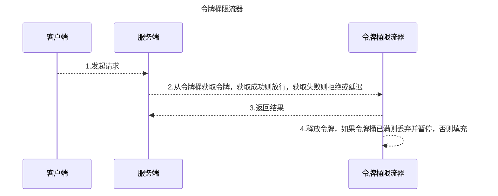

# 令牌桶限流器

```mermaid
---
title: 令牌桶限流器
---
sequenceDiagram
    客户端-->>服务端:1.发起请求
    服务端-->>令牌桶限流器:2.从令牌桶获取令牌，获取成功则放行，获取失败则拒绝或延迟
    令牌桶限流器-->>服务端:3.返回结果
    令牌桶限流器-->>令牌桶限流器:4.释放令牌，如果令牌桶已满则丢弃并暂停，否则填充
```